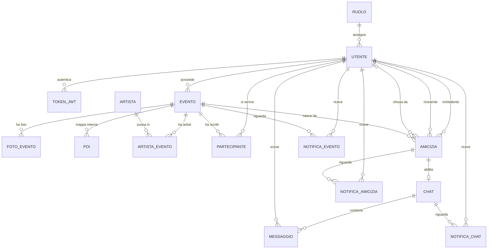

# NoseY – Progettazione (v4)

Documento unico di progettazione del backend: convenzioni, endpoint REST, WebSocket, sicurezza, schema del database e decisioni. Sostituisce il documento degli endpoint v3 e il diagramma ER precedente.

## Modifiche rispetto alla v3

- **Id:** UUID in tutte le tabelle. Lo schema è riscritto per intero (sezione 15, con diagramma e DDL) ed è allineato agli endpoint.
- **Account e codici:** la registrazione sovrascrive gli account non ancora verificati, e la verifica chiede codice e password e fa già il login. I codici hanno limiti di invio (uno ogni 60 secondi, 5 al giorno) e i tentativi si contano in modo atomico.
- **Nuove funzionalità:** password dimenticata, rimozione di un amico, ritiro di una richiesta di amicizia.
- **Amicizie:** nuovi stati RIMOSSA e RITIRATA e rifiuto silenzioso. Il proprietario dell'evento partecipa alle amicizie, e `statoAmicizia` ha il valore NON_DISPONIBILE.
- **Frontend:** `attivo` in UtentePubblicoResponse e `puoiScrivere` in ChatResponse, per disattivare pulsanti e campo di testo.
- **Notifiche:**
  - arrivano anche per artisti e POI;
  - MODIFICA e ISCRIZIONE si accorpano;
  - nessun nome di persona nei testi salvati;
  - regole precise per i non letti delle chat.
- **Anonimizzazione:** ruolo riportato a USER, iscrizioni a eventi futuri cancellate, conteggio dei soli SUPERADMIN attivi.
- **Sicurezza:**
  - regole su SEND e SUBSCRIBE WebSocket;
  - `/error` pubblico;
  - limite dei 72 byte su ogni password;
  - limiti di frequenza;
  - primo SUPERADMIN solo su un account verificato.
- **Coerenza:**
  - date `Instant` e coordinate `double`;
  - testi non vuoti nelle PATCH;
  - email normalizzata nel DTO;
  - catalogo completo dei codici di errore;
  - PaginaResponse e cursore per i messaggi;
  - ordine dei controlli definito.
- **Foto:** cambio della copertina senza conflitti con l'indice unico, colonna `caricata_il`.
- **AI:** la descrizione da migliorare si può passare nel body.
- **Email:** Brevo via API HTTP in produzione, perché Render gratuito blocca SMTP. Tolta l'email "nuova iscrizione" al proprietario.
- **Health check:** `GET /api/stato` resta pubblico: è quello del template.
- **Decisioni:** tutte chiuse (sezione 16), nel formato Scelta / Motivazione / Alternative scartate.

## Indice

0. Convenzioni · 1. Auth · 2. Utente · 3. Eventi · 4. Foto · 5. POI · 6. Artisti · 7. Partecipanti · 8. Amicizie · 9. Chat · 10. Notifiche · 11. WebSocket · 12. Admin · 13. Superadmin · 14. Sicurezza · 15. Schema del database · 16. Decisioni · 17. Limiti noti · 18. Note di implementazione

---

## 0. CONVENZIONI

```
- Base URL: /api · JSON in entrata e in uscita (upload: multipart/form-data)
- Autenticazione: header  Authorization: Bearer <token>
    durata del token 24 ore (variabile JWT_DURATA) · nessun refresh token
- Id: UUID ovunque · variabili nel percorso in camelCase
    {id} = evento · {fotoId} · {poiId} · {artistaId} · {amiciziaId} · {chatId} · {utenteId} · {notificaId}
- Percorsi e parametri di query in inglese; nomi degli endpoint e campi dei DTO in italiano camelCase
- Metodi:
    GET     lettura
    POST    creazione, oppure azione con verifiche ed effetti collaterali
            → un verbo nel percorso (/cancel, /accept, /withdraw, /anonymize...) è sempre POST
    PATCH   modifica parziale di campi
            (anche /read: segna solo come letto, senza creare risorse né notificare nessuno)
    DELETE  rimozione
    (PUT non viene usato)
- PATCH: campo assente o null = invariato · "" su un testo facoltativo = rimosso
         body senza nessun campo valorizzato → 400 RICHIESTA_VUOTA
- Chi fa la richiesta si ricava SEMPRE dal token, mai dal body
- Sempre DTO, mai entità: in entrata solo i campi modificabili, in uscita solo quelli visibili
- /api/users/me/... = profilo dell'utente e ciò che ha creato o a cui è iscritto (eventi, ticket)
    amicizie, chat e notifiche hanno percorsi propri e restituiscono solo i dati di chi fa la richiesta
- Sotto-risorse (esistono solo dentro il padre): /api/events/{id}/photos, /pois, /artists, /participants
- Paginazione: ?page=0&size=20 (size massimo 100)
    → PaginaResponse<T> { contenuto, pagina, dimensione, totaleElementi, totalePagine }
    mai il Page di Spring serializzato così com'è: il suo JSON non è garantito stabile
    eccezione: i messaggi usano un cursore (sezione 9)
- Date: ISO 8601 con fuso orario (es. 2026-10-03T21:00:00+02:00)
    Java: Instant · DB: timestamptz · confronti con equals / isBefore / isAfter di Instant
    niente OffsetDateTime: il suo equals confronta anche l'offset, e lo stesso istante
    risulterebbe "diverso" a seconda del fuso della JVM
    unica eccezione: dataNascita → LocalDate · DB: date
    "adesso" si calcola una volta per richiesta, da un Clock iniettato (utile anche nei test)
- Coordinate: double in Java e double precision nel DB (niente BigDecimal: il suo equals confronta la scala)
- Testi: salvati con strip()
    «non vuoto» = @Pattern(regexp = "(?s).*\\S.*"): se il campo c'è, deve contenere almeno
    un carattere che non sia uno spazio (serve nelle PATCH, dove @NotBlank non si può usare)
- Email: normalizzate (strip + toLowerCase(Locale.ROOT)) NEL DTO, nel costruttore compatto del record,
    così la validazione @Email vede già il valore pulito (con uno spazio iniziale fallirebbe)
- Password: al massimo 72 BYTE in UTF-8 (limite reale di BCrypt), oltre alle regole @Size
    password nuova (registrazione, cambio, reset) oltre 72 byte → 400 VALIDAZIONE
    password da controllare (login, verifica, password attuale, anonimizzazione) oltre 72 byte
      → si risponde come per una password errata, senza chiamare matches()
        (a seconda della versione, matches() con input troppo lunghi lancia un'eccezione)
- Dopo il commit (@TransactionalEventListener(phase = AFTER_COMMIT)):
    email (anche @Async) · push WebSocket (messaggi e notifiche live) · cancellazioni dallo storage
    se uno di questi passi fallisce si scrive nel log: la richiesta resta valida
- Concorrenza:
    le scritture che dipendono dallo stato o dai limiti di un evento (modifica, annullamento, foto,
    POI, artisti, iscrizione, notifica manuale) leggono l'evento con lock PESSIMISTIC_WRITE
    le transizioni di un'amicizia leggono la sua riga con lock PESSIMISTIC_WRITE
    DataIntegrityViolationException → 409, con il codice del vincolo quando è noto
      uq_utente_email → EMAIL_GIA_REGISTRATA · uq_partecipante → GIA_ISCRITTO
      pk_artista_evento → ARTISTA_GIA_ASSOCIATO · uq_artista_nome → ARTISTA_NOME_GIA_USATO
      altrimenti CONFLITTO
- Ordine dei controlli: 401 (filtro) → 400 VALIDAZIONE del DTO → 429 → 404 sulla risorsa principale
    → 403 → 404 sulla sotto-risorsa → controlli di merito, nell'ordine in cui sono elencati
```

### Upload

```
- spring.servlet.multipart.max-file-size = 5MB · max-request-size = 6MB
- server.tomcat.max-swallow-size = 10MB
    con file oltre il limite Tomcat può chiudere la connessione, e il browser vedrebbe un errore
    di rete invece del 400 · il frontend controlla comunque tipo e dimensione prima di inviare
- MaxUploadSizeExceededException → 400 FILE_NON_VALIDO
- Tipo verificato sui primi byte del file, non sull'estensione né sul Content-Type:
    JPEG  FF D8 FF
    PNG   89 50 4E 47 0D 0A 1A 0A
    WEBP  "RIFF" + 4 byte + "WEBP"
    (ImageIO non legge i WEBP: non usatelo per la verifica)
- Flusso:
    1. controlli: prima il file (presenza, dimensione, tipo: fanno parte della validazione),
       poi permessi, stato e limiti
    2. upload su Cloudinary FUORI dalla transazione (una chiamata lenta non deve tenere occupata
       una connessione al database)
    3. transazione breve: lock sull'evento, si ricontrollano stato e limiti, si salva la riga
    se il passo 3 fallisce, il file appena caricato si cancella
- Nelle rimozioni il file si cancella dallo storage DOPO il commit
```

### Stato dell'evento

```
Campo "stato" nei DTO, enum StatoEvento
    PROGRAMMATO   adesso < dataEvento
    IN_CORSO      dataEvento <= adesso <= dataFine
    CONCLUSO      adesso > dataFine
    ANNULLATO     annullato dal proprietario o dalla moderazione (vale a prescindere dalle date)

Nel DB si salva solo PROGRAMMATO | ANNULLATO: IN_CORSO e CONCLUSO si CALCOLANO dalle date,
così non serve un job che aggiorni gli stati e non possono andare fuori sincrono.
StatoEvento a 4 valori esiste solo nei DTO e si calcola nel mapper;
l'entità usa un enum separato a 2 valori, StatoEventoDb (sezione 15).

Scritture (modifica, foto, POI, artisti, AI, iscrizione, notifica manuale)
    → 409 EVENTO_CONCLUSO o EVENTO_ANNULLATO
Eccezione: RimuoviFotoModerazione vale anche su eventi conclusi o annullati
```

### Codici HTTP

```
400  validazione fallita o richiesta non valida
401  token mancante, scaduto o revocato → il frontend fa logout
     (tranne sulla risposta di /api/auth/login, dove significa solo "credenziali errate")
     una password sbagliata dentro un'azione (cambio password, anonimizzazione...) è 400, mai 401
403  autenticato ma senza permesso (ruolo, proprietario, ticket...)
     al login: email non verificata o account sospeso
404  risorsa inesistente o non appartenente alla risorsa del percorso
409  conflitto con lo stato attuale (duplicato, evento concluso o annullato, limite raggiunto)
429  troppe richieste (vedi Limiti)
500  errore inatteso (codice ERRORE_INTERNO)
502  servizio esterno non disponibile (Cloudinary, provider AI)
```

### ErroreResponse

```
{ status, codice, errore, messaggio, campi: { nomeCampo: messaggio }, timestamp }
    codice: stringa stabile in MAIUSCOLO · il frontend decide in base a codice, MAI a messaggio
    campi: solo con VALIDAZIONE · mai stack trace né messaggi interni
Sul WebSocket gli errori arrivano come { codice, messaggio } su /user/queue/errors
```

Catalogo completo dei codici:

| Area | Codice | HTTP | Quando |
|---|---|---|---|
| Generali | VALIDAZIONE | 400 | campi del DTO o parametri non validi (dettaglio in `campi`) |
| | RICHIESTA_VUOTA | 400 | PATCH senza nessun campo valorizzato |
| | FILE_NON_VALIDO | 400 | file mancante, troppo grande o di tipo non ammesso |
| | CATEGORIA_NON_VALIDA | 400 | categoria di notifica diversa da events, friendships, chats |
| | NON_AUTENTICATO | 401 | token mancante, scaduto o revocato |
| | ACCESSO_NEGATO | 403 | ruolo insufficiente per il percorso (/api/admin, /api/superadmin) |
| | NON_TROVATO | 404 | risorsa inesistente o non raggiungibile da chi chiede |
| | CONFLITTO | 409 | vincolo del database violato, senza un codice più preciso |
| | TROPPE_RICHIESTE | 429 | superato un limite di frequenza (anche sul WebSocket) |
| | ERRORE_INTERNO | 500 | errore inatteso |
| | SERVIZIO_ESTERNO | 502 | Cloudinary o provider AI non disponibili |
| Auth | EMAIL_GIA_REGISTRATA | 409 | registrazione con un'email già verificata, o di un account sospeso |
| | GIA_VERIFICATO | 409 | verifica di un account già verificato |
| | CODICE_NON_VALIDO | 400 | codice errato, o account o codice inesistente |
| | CODICE_SCADUTO | 400 | codice oltre i 15 minuti o con 5 tentativi usati: ne serve uno nuovo |
| | PASSWORD_ERRATA | 400 | password sbagliata in verifica, cambio password o anonimizzazione |
| | CREDENZIALI_ERRATE | 401 | login fallito (solo su /api/auth/login) |
| | EMAIL_NON_VERIFICATA | 403 | login con la password giusta ma email non verificata |
| | ACCOUNT_SOSPESO | 403 | login o verifica di un account sospeso |
| Utente | PASSWORD_UGUALE | 400 | la nuova password è uguale a quella attuale |
| | ULTIMO_SUPERADMIN | 409 | anonimizzazione dell'unico SUPERADMIN attivo |
| Eventi | NON_PROPRIETARIO | 403 | azione riservata al proprietario dell'evento |
| | EVENTO_CONCLUSO | 409 | scrittura su un evento concluso |
| | EVENTO_ANNULLATO | 409 | scrittura su un evento annullato |
| | EVENTO_GIA_INIZIATO | 409 | dataEvento cambiata o iscrizione annullata con evento in corso |
| | DATA_NON_FUTURA | 400 | data cambiata e non futura |
| | DATE_NON_VALIDE | 400 | dataFine non successiva a dataEvento |
| | POI_FUORI_RAGGIO | 409 | lo spostamento dell'evento lascerebbe dei POI a più di 2 km |
| | DESCRIZIONE_MANCANTE | 400 | AI senza descrizione (né nel body né salvata) |
| Foto e POI | LIMITE_FOTO | 409 | l'evento ha già 10 foto |
| | COPERTINA_NON_VALIDA | 400 | `copertina = false` in ModificaFoto |
| | LIMITE_POI | 409 | l'evento ha già 15 POI |
| | POI_TROPPO_LONTANO | 400 | POI a più di 2 km dalla posizione dell'evento |
| Artisti | ARTISTA_GIA_ASSOCIATO | 409 | artista già presente nell'evento |
| | ARTISTA_NON_ATTIVO | 409 | artista disattivato |
| | ARTISTA_NOME_GIA_USATO | 409 | nome già usato (senza distinzione tra maiuscole e minuscole) |
| | ARTISTA_IN_USO | 409 | eliminazione di un artista associato a uno o più eventi |
| Partecipanti | PROPRIETARIO_NON_ISCRIVIBILE | 409 | il proprietario prova a iscriversi al proprio evento |
| | GIA_ISCRITTO | 409 | iscrizione doppia |
| | NESSUN_TICKET | 403 | serve un ticket per l'evento (lista partecipanti, richiesta di amicizia) |
| Amicizie | RICHIESTA_A_SE_STESSO | 400 | richiesta di amicizia a se stessi |
| | UTENTE_NON_ATTIVO | 409 | l'altro utente è sospeso o anonimizzato |
| | RICHIESTA_GIA_INVIATA | 409 | c'è già una richiesta in attesa verso quell'utente |
| | RICHIESTA_GIA_RICEVUTA | 409 | l'altro ti ha già chiesto l'amicizia: va accettata |
| | GIA_AMICI | 409 | siete già amici |
| | AMICIZIA_NON_DISPONIBILE | 409 | l'altro ha rimosso l'amicizia: solo lui può riaprirla |
| | NON_RICEVENTE | 403 | accetta o rifiuta da parte di chi non è il ricevente |
| | NON_RICHIEDENTE | 403 | ritiro da parte di chi non è il richiedente |
| | NON_IN_ATTESA | 409 | la richiesta non è più in attesa |
| | NON_AMICI | 409 | rimozione di un'amicizia non accettata |
| Chat | NON_MEMBRO | 403 | la chat non è tua |
| | CHAT_SOLA_LETTURA | — (WS) | amicizia non accettata o altro utente non attivo |
| | TOKEN_NON_VALIDO | — (WS) | il token della connessione è scaduto o revocato: serve riconnettersi |
| Admin | RUOLO_INSUFFICIENTE | 403 | utente o contenuto di un ruolo uguale o superiore al tuo, o te stesso |
| | STATO_NON_AMMESSO | 400 | stato diverso da ATTIVO o SOSPESO |
| | UTENTE_ANONIMIZZATO | 409 | cambio di stato di un utente anonimizzato |
| | RUOLO_NON_AMMESSO | 400 | ruolo diverso da USER o ADMIN |
| | UTENTE_NON_VERIFICATO | 409 | cambio di ruolo di un utente non verificato |

### Limiti di frequenza

| Cosa | Limite | Risposta |
|---|---|---|
| Login | 10 tentativi falliti in 15 minuti per la stessa email | 429 TROPPE_RICHIESTE |
| Invio di codici (verifica, reset) | 1 ogni 60 secondi e 5 ogni 24 ore per account | 429 TROPPE_RICHIESTE |
| Tentativi su un codice | 5, poi serve un nuovo codice | 400 CODICE_SCADUTO |
| Miglioramento AI | 10 all'ora per utente | 429 TROPPE_RICHIESTE |
| Iscrizioni agli eventi | 20 al giorno per utente | 429 TROPPE_RICHIESTE |
| Richieste di amicizia | 30 al giorno per utente | 429 TROPPE_RICHIESTE |
| Notifiche manuali | 5 al giorno per evento | 429 TROPPE_RICHIESTE |
| Messaggi in chat | 30 al minuto per utente | errore WS TROPPE_RICHIESTE |

I limiti sui codici stanno nel database (colonne di UTENTE) e sopravvivono ai riavvii. Gli altri stanno in memoria (Bucket4j o una mappa con i timestamp) e si azzerano a ogni riavvio, cosa accettabile con una sola istanza. I valori sono indicativi e configurabili.

### Email

| # | Email | A chi | Quando |
|---|---|---|---|
| 1 | Codice di verifica | chi si registra | Registrazione (anche quando sovrascrive un account non verificato) e ReinviaCodice |
| 2 | Ticket | il partecipante | IscrizioneEvento |
| 3 | Codice per reimpostare la password | l'utente | PasswordDimenticata |
| 4 | Password cambiata | l'utente | CambioPassword e ReimpostaPassword |

```
- Sempre DOPO il commit e @Async: se l'invio fallisce si scrive nel log, la richiesta resta valida
- Interfaccia EmailService con due implementazioni, scelte dal profilo Spring:
    locale      SmtpEmailService   Gmail SMTP con password per le app
    produzione  BrevoEmailService  POST https://api.brevo.com/v3/smtp/email, header api-key
- Render gratuito blocca le porte SMTP (25, 465, 587); l'API di Brevo viaggia su HTTPS
- Brevo gratuito: 300 email al giorno · servono un account e la conferma dell'indirizzo mittente
- Variabili: BREVO_API_KEY, MAIL_FROM (in locale MAIL_USERNAME, MAIL_PASSWORD)
```

### DTO comuni

```
UtentePubblicoResponse   { id, nome, cognome, immagineProfilo, attivo }
    ← ovunque compaia un ALTRO utente (partecipanti, amici, chat, proprietario dell'evento)
    attivo = false per utenti sospesi o anonimizzati: il frontend disattiva "aggiungi" e la chat

UtenteResponse           { id, email, nome, cognome, indirizzo, dataNascita, immagineProfilo, ruolo }
    ← SOLO per l'utente stesso

LoginResponse            { token, scadenza, utente: UtenteResponse }

TicketResponse           { id, codice, emessoIl,
                           evento { id, titolo, dataEvento, dataFine, stato, lat, lng },
                           partecipante { nome, cognome } }

PaginaResponse<T>        { contenuto: List<T>, pagina, dimensione, totaleElementi, totalePagine }
```

---

## 1. AUTH

### Codici via email (verifica dell'email e reset della password)

```
- 6 cifre generate con SecureRandom, valide 15 minuti, un solo codice attivo per account
    colonne: codice, codice_scopo (VERIFICA_EMAIL | RESET_PASSWORD), codice_inviato_il, codice_tentativi
- Invio: al massimo 1 ogni 60 secondi e 5 ogni 24 ore per account → altrimenti 429 TROPPE_RICHIESTE
    colonne invii_codice e invii_codice_dal: la finestra riparte quando sono passate 24 ore
    la decisione di invio legge l'utente con lock PESSIMISTIC_WRITE (due richieste insieme = un invio)
- Ogni nuovo codice azzera codice_tentativi
- Scaduto = adesso > codice_inviato_il + 15 minuti, oppure codice_tentativi >= 5
    il codice NON si cancella quando scade: codice_inviato_il serve al limite dei 60 secondi
- Ogni tentativo si consuma PRIMA del confronto, con un UPDATE atomico:
    UPDATE utente SET codice_tentativi = codice_tentativi + 1
    WHERE id = :id AND codice_tentativi < 5
    0 righe aggiornate → 400 CODICE_SCADUTO
    (con un contatore letto e poi salvato, richieste in parallelo supererebbero i 5 tentativi)
- Dopo l'uso corretto: codice e codice_scopo → null, codice_tentativi → 0
```

```
Registrazione            POST /api/auth/register
  - Accesso: pubblico
  - DTO req (RegisterRequest)
      email        @NotBlank @Email @Size(max = 255)        (normalizzata nel DTO)
      password     @NotBlank @Size(min = 8, max = 72) + max 72 byte
      nome         @NotBlank @Size(max = 100)
      cognome      @NotBlank @Size(max = 100)
      indirizzo    @Size(max = 255)                          (facoltativo)
      dataNascita  @NotNull @Past
  - Resp: 201 Created + { id, email }        ← MAI il codice
  - Errori: 400 VALIDAZIONE,
            409 EMAIL_GIA_REGISTRATA (account verificato, oppure non verificato ma SOSPESO),
            429 TROPPE_RICHIESTE (email non verificata già presente e limiti di invio superati)
  - Effetti:
      email nuova → UTENTE con ruolo USER, stato ATTIVO, verificato = false
      email già presente, NON verificata e ATTIVO → si sovrascrivono password, nome, cognome,
        indirizzo e dataNascita: nessuno ha ancora dimostrato di possedere quell'email,
        quindi nessuno può "occuparla" registrandosi per primo
      in entrambi i casi: nuovo codice VERIFICA_EMAIL → email 1 (dopo il commit)
  - Note: il 409 rivela che l'email è registrata: compromesso accettato per l'usabilità

Verifica                 POST /api/auth/verify
  - Accesso: pubblico
  - DTO req (VerifyRequest)
      email     @NotBlank @Email                (normalizzata nel DTO)
      codice    @NotBlank @Pattern("\\d{6}")
      password  @NotBlank @Size(max = 72)
  - Resp: 200 + LoginResponse                  ← la verifica fa già il login
  - Controlli, in quest'ordine:
      1. account inesistente o anonimizzato                      → 400 CODICE_NON_VALIDO
      2. account già verificato                                  → 409 GIA_VERIFICATO
      3. account sospeso                                         → 403 ACCOUNT_SOSPESO
      4. nessun codice VERIFICA_EMAIL valido (scaduto o 5 tentativi usati) → 400 CODICE_SCADUTO
      5. tentativo consumato (UPDATE atomico); codice diverso      → 400 CODICE_NON_VALIDO
      6. password diversa da quella della registrazione, o oltre 72 byte → 400 PASSWORD_ERRATA
         (il messaggio invita a registrarsi di nuovo: la registrazione più recente sovrascrive i dati)
  - Effetti: verificato = true · codice → null · token emesso e salvato in TOKEN_JWT, come al login
  - Note: il codice arriva nella casella email, la password l'ha scelta chi si è registrato:
          chiederli insieme garantisce che chi verifica sia chi si è registrato

ReinviaCodice            POST /api/auth/resend-code
  - Accesso: pubblico
  - DTO req: { email @NotBlank @Email }        (normalizzata nel DTO)
  - Resp: 204 No Content
  - Errori: 400 VALIDAZIONE, 429 TROPPE_RICHIESTE (limiti di invio)
  - Effetti: account non verificato e ATTIVO → nuovo codice VERIFICA_EMAIL → email 1
             altrimenti (inesistente, verificato, sospeso, anonimizzato) nessun effetto, 204
  - Note: il 429 arriva solo per account esistenti: come il 409 della registrazione,
          rivela che l'email è registrata (compromesso accettato)

Login                    POST /api/auth/login
  - Accesso: pubblico
  - DTO req (LoginRequest)
      email     @NotBlank @Email @Size(max = 255)   (normalizzata nel DTO)
      password  @NotBlank @Size(max = 72)
  - Resp: 200 + LoginResponse { token, scadenza, utente: UtenteResponse }
  - Controlli, in quest'ordine:
      1. 10 tentativi falliti negli ultimi 15 minuti per quell'email       → 429 TROPPE_RICHIESTE
      2. utente inesistente o anonimizzato, password oltre 72 byte (senza chiamare matches())
         o password errata → 401 CREDENZIALI_ERRATE, e conta come tentativo fallito
      3. email non verificata                                               → 403 EMAIL_NON_VERIFICATA
      4. account sospeso                                                    → 403 ACCOUNT_SOSPESO
      i 403 arrivano solo dopo una password corretta, quindi non rivelano quali email esistono
  - Effetti: salva il jti in TOKEN_JWT con la scadenza · azzera i tentativi falliti

Logout                   POST /api/auth/logout
  - Accesso: autenticato
  - Resp: 204 No Content
  - Effetti: revocato = true sul jti corrente

PasswordDimenticata      POST /api/auth/password/forgot
  - Accesso: pubblico
  - DTO req: { email @NotBlank @Email }        (normalizzata nel DTO)
  - Resp: 204 No Content
  - Errori: 400 VALIDAZIONE, 429 TROPPE_RICHIESTE (limiti di invio)
  - Effetti: account verificato e ATTIVO → nuovo codice RESET_PASSWORD → email 3
             altrimenti nessun effetto, 204
             (un account non verificato usa ReinviaCodice: non ha una password "dimenticata")

ReimpostaPassword        POST /api/auth/password/reset
  - Accesso: pubblico
  - DTO req (ReimpostaPasswordRequest)
      email          @NotBlank @Email            (normalizzata nel DTO)
      codice         @NotBlank @Pattern("\\d{6}")
      nuovaPassword  @NotBlank @Size(min = 8, max = 72) + max 72 byte
  - Resp: 204 No Content
  - Controlli, in quest'ordine:
      1. account inesistente, non verificato, non ATTIVO o senza codice RESET_PASSWORD
                                                                  → 400 CODICE_NON_VALIDO
      2. codice scaduto o 5 tentativi usati                        → 400 CODICE_SCADUTO
      3. tentativo consumato (UPDATE atomico); codice diverso      → 400 CODICE_NON_VALIDO
  - Effetti (una transazione): nuovo hash · codice → null · revoca TUTTI i token (logout ovunque)
             email 4 "password cambiata" (dopo il commit)
  - Note: non fa il login: si entra con la nuova password
```

---

## 2. UTENTE

```
VediProfilo              GET /api/users/me
  - Accesso: autenticato
  - DTO resp: UtenteResponse
  - Note: il frontend lo chiama all'avvio per ricostruire lo stato dopo un refresh

ModificaProfilo          PATCH /api/users/me
  - Accesso: autenticato
  - DTO req (ModificaUtenteRequest)   ← tutti facoltativi
      nome         @Size(max = 100) + non vuoto
      cognome      @Size(max = 100) + non vuoto
      indirizzo    @Size(max = 255)      "" = rimuovi
      dataNascita  @Past
  - Resp: 200 + UtenteResponse
  - Errori: 400 VALIDAZIONE, 400 RICHIESTA_VUOTA
  - Note: email non modificabile · password → CambioPassword · immagine → CaricaImmagineProfilo

CaricaImmagineProfilo    POST /api/users/me/avatar
  - Accesso: autenticato
  - Body: multipart/form-data, campo "file"
  - Vincoli: JPEG, PNG, WEBP (verificati sui primi byte) · max 2 MB
  - Resp: 200 + UtenteResponse
  - Errori: 400 FILE_NON_VALIDO, 502 SERVIZIO_ESTERNO
  - Effetti: salva url e public_id della nuova immagine (flusso di upload delle convenzioni)
             dopo il commit cancella la precedente dallo storage

RimuoviImmagineProfilo   DELETE /api/users/me/avatar
  - Accesso: autenticato
  - Resp: 204 No Content
  - Errori: 404 NON_TROVATO (nessuna immagine impostata)
  - Effetti: url e public_id → null · dopo il commit cancella il file dallo storage

CambioPassword           POST /api/users/me/password
  - Accesso: autenticato
  - DTO req (CambioPasswordRequest)
      passwordAttuale  @NotBlank @Size(max = 72)
      nuovaPassword    @NotBlank @Size(min = 8, max = 72) + max 72 byte
  - Resp: 204 No Content
  - Errori: 400 VALIDAZIONE,
            400 PASSWORD_ERRATA (anche per una password attuale oltre 72 byte, senza matches()),
            400 PASSWORD_UGUALE
  - Effetti (una transazione): nuovo hash · revoca tutti i token dell'utente TRANNE quello corrente
             email 4 "password cambiata" (dopo il commit)

Anonimizzazione          POST /api/users/me/anonymize
  - Accesso: autenticato
  - DTO req: { password @NotBlank @Size(max = 72) }     ← conferma: operazione irreversibile
  - Resp: 204 No Content
  - Errori: 400 PASSWORD_ERRATA,
            409 ULTIMO_SUPERADMIN (sei SUPERADMIN e non ce n'è un altro con stato ATTIVO)
  - Effetti (una transazione):
      dati personali   email → anon-{id}@nosey.invalid · nome/cognome → "Utente"/"anonimo"
                       indirizzo, dataNascita, immagine → null (file cancellato dopo il commit)
      account          passwordHash → hash di un valore casuale · codice → null
                       stato → ANONIMIZZATO · ruolo → USER · revoca TUTTI i token
      notifiche        quelle ricevute si cancellano (tutte e tre le tabelle)
      amicizie         PENDENTE (inviate e ricevute) → RITIRATA, e si cancellano
                       le notifiche RICHIESTA collegate
                       ACCETTATA → restano: l'altro vede "Utente anonimo" con attivo = false
                       e la chat in sola lettura
      eventi propri    PROGRAMMATO → ANNULLATO, con NOTIFICA_EVENTO ANNULLAMENTO ai partecipanti
                       IN_CORSO e CONCLUSO restano
      iscrizioni       a eventi PROGRAMMATO → cancellate
                       le altre (ticket di eventi in corso, conclusi o annullati) restano
      messaggi         restano, mostrati come "Utente anonimo"
  - Note: nessun testo salvato contiene nomi di persone (sezione 10): non resta nulla da ripulire altrove

MieiEventi               GET /api/users/me/events
  - Accesso: autenticato
  - DTO resp: List<EventoMappaResponse> (sezione 3), compresi conclusi e annullati,
              per dataEvento decrescente · distanzaKm = null

MieiTicket               GET /api/users/me/tickets
  - Accesso: autenticato
  - DTO resp: List<TicketResponse>: prima gli eventi PROGRAMMATO e IN_CORSO per dataEvento crescente,
              poi CONCLUSO e ANNULLATO per dataEvento decrescente
```

---

## 3. EVENTI

```
EventoMappaResponse      { id, titolo, dataEvento, dataFine, stato, lat, lng, copertinaUrl, distanzaKm }

ListaEventiMappa         GET /api/events?lat=&lng=
  - Accesso: pubblico
  - Query param facoltativi (posizione dell'utente, solo con il suo consenso):
      lat  @DecimalMin("-90")  @DecimalMax("90")
      lng  @DecimalMin("-180") @DecimalMax("180")
      tutti e due o nessuno, altrimenti 400 VALIDAZIONE
      il frontend li arrotonda a 2 decimali (circa 1 km): bastano per ordinare e finiscono nei log
  - DTO resp: List<EventoMappaResponse> · distanzaKm = null se lat/lng non passati
  - Note: solo eventi PROGRAMMATO e IN_CORSO (niente conclusi né annullati)
            → nel DB: stato = PROGRAMMATO e data_fine >= adesso
          con lat/lng → per distanza crescente (Haversine in Java) · senza → per dataEvento crescente
          la posizione cambia l'ORDINE, mai il numero di eventi (requisito della traccia)

VediEvento               GET /api/events/{id}
  - Accesso: pubblico. Con un token valido calcola sonoProprietario e sonoIscritto;
             token scaduto o non valido → ignorato, risposta come per un anonimo (mai 401)
  - DTO resp (EventoDettaglioResponse)
      id, titolo, descrizione, dataEvento, dataFine, stato, motivoAnnullamento, lat, lng,
      proprietario        UtentePubblicoResponse
      foto                List<FotoResponse>     prima la copertina, poi per caricata_il
      artisti             List<ArtistaResponse>  in ordine alfabetico
      poi                 List<PoiResponse>
      numeroPartecipanti
      sonoProprietario    boolean (false se anonimo)
      sonoIscritto        boolean (false se anonimo)
  - Errori: 404 NON_TROVATO
  - Note: i partecipanti NON sono qui (ListaPartecipanti, solo con ticket o da proprietario)
          anche gli eventi annullati sono visibili qui, con stato ANNULLATO e il motivo
          foto, artisti e POI si leggono con query separate
          (un fetch join su più List nella stessa query dà MultipleBagFetchException)

CreaEvento               POST /api/events
  - Accesso: autenticato
  - DTO req (EventoRequest)
      titolo       @NotBlank @Size(max = 150)
      descrizione  @Size(max = 5000)            (facoltativa)
      dataEvento   @NotNull @Future
      dataFine     @NotNull @Future
      lat          @NotNull @DecimalMin("-90")  @DecimalMax("90")
      lng          @NotNull @DecimalMin("-180") @DecimalMax("180")
  - Resp: 201 Created + EventoDettaglioResponse
  - Errori: 400 VALIDAZIONE, 400 DATE_NON_VALIDE (dataFine non successiva a dataEvento)
  - Note: proprietario = utente del token · stato iniziale PROGRAMMATO

ModificaEvento           PATCH /api/events/{id}
  - Accesso: proprietario
  - DTO req (ModificaEventoRequest)   ← tutti facoltativi
      titolo       @Size(max = 150) + non vuoto
      descrizione  @Size(max = 5000)     "" = rimuovi
      dataEvento   (niente @Future sul DTO: vedi controlli)
      dataFine     (niente @Future sul DTO: vedi controlli)
      lat          @DecimalMin("-90")  @DecimalMax("90")
      lng          @DecimalMin("-180") @DecimalMax("180")
  - Un campo "cambia" solo se è presente e diverso dal valore salvato
      (date come Instant, coordinate come double, testi dopo strip())
  - Errori del DTO: 400 VALIDAZIONE, 400 RICHIESTA_VUOTA
  - Controlli, in quest'ordine (evento letto con lock):
      1. evento inesistente                                    → 404 NON_TROVATO
      2. non sei il proprietario                               → 403 NON_PROPRIETARIO
      3. evento concluso o annullato                           → 409 EVENTO_CONCLUSO / EVENTO_ANNULLATO
      4. dataEvento cambiata con evento IN_CORSO               → 409 EVENTO_GIA_INIZIATO
      5. dataEvento o dataFine cambiata e non futura           → 400 DATA_NON_FUTURA
         (le date rimandate invariate non contano: niente errore su un evento già iniziato)
      6. dopo aver applicato le modifiche, dataFine non successiva a dataEvento → 400 DATE_NON_VALIDE
      7. lat o lng cambiate e un POI resterebbe a più di 2 km  → 409 POI_FUORI_RAGGIO
         (i POI vanno spostati o cancellati prima)
  - Resp: 200 + EventoDettaglioResponse
  - Effetti: almeno un campo cambiato → NOTIFICA_EVENTO MODIFICA ai partecipanti, con le parti
             cambiate (titolo, descrizione, date, luogo), accorpata (sezione 10)
             nessun campo cambiato → 200 senza notifiche

MiglioraDescrizioneAI    POST /api/events/{id}/description/ai
  - Accesso: proprietario
  - DTO req
      fotoId       @NotNull
      descrizione  @Size(max = 5000)   facoltativa: se manca o è vuota si usa quella salvata
                                       (così si migliora anche un testo non ancora salvato)
  - Resp: 200 + { descrizioneProposta }
  - Errori: 400 VALIDAZIONE, 429 TROPPE_RICHIESTE (10 all'ora), 404 NON_TROVATO (evento),
            403 NON_PROPRIETARIO, 404 NON_TROVATO (foto inesistente o di un altro evento),
            409 EVENTO_CONCLUSO / EVENTO_ANNULLATO,
            400 DESCRIZIONE_MANCANTE (né nel body né salvata), 502 SERVIZIO_ESTERNO
  - Note: invia al provider SIA l'immagine SIA la descrizione (requisito della traccia)
          NON salva: la conferma avviene con ModificaEvento { descrizione }
          la chiave API sta solo nel backend (variabile d'ambiente) · timeout sulla chiamata
          serve almeno una foto: in creazione il frontend fa CreaEvento → CreaFoto → AI

AnnullaEvento            POST /api/events/{id}/cancel
  - Accesso: proprietario
  - DTO req: { motivo @Size(max = 500) }   (facoltativo)
  - Resp: 204 No Content
  - Errori: 400 VALIDAZIONE, 404 NON_TROVATO, 403 NON_PROPRIETARIO,
            409 EVENTO_CONCLUSO / EVENTO_ANNULLATO
  - Effetti (evento letto con lock): stato → ANNULLATO (irreversibile) · motivo in motivo_annullamento
             NOTIFICA_EVENTO ANNULLAMENTO a tutti i partecipanti, con il motivo se c'è
  - Note: si può annullare anche un evento IN_CORSO
          l'evento sparisce dalla mappa ma resta visibile nel dettaglio e nei ticket

InviaNotificaManuale     → sezione 10
```

---

## 4. FOTO  (sotto-risorsa dell'evento)

```
FotoResponse             { id, url, didascalia, copertina }

CreaFoto                 POST /api/events/{id}/photos
  - Accesso: proprietario
  - Body: multipart/form-data
      file        obbligatorio
      didascalia  max 150 caratteri (facoltativa, testo alternativo)
  - Vincoli: JPEG, PNG, WEBP (verificati sui primi byte) · max 5 MB · max 10 foto per evento
  - Resp: 201 Created + FotoResponse
  - Errori: 400 FILE_NON_VALIDO, 400 VALIDAZIONE (didascalia), 404 NON_TROVATO, 403 NON_PROPRIETARIO,
            409 EVENTO_CONCLUSO / EVENTO_ANNULLATO, 409 LIMITE_FOTO, 502 SERVIZIO_ESTERNO
  - Effetti: flusso di upload delle convenzioni; nella transazione, con il lock sull'evento,
             copertina = true se l'evento non ne ha ancora una
             nessuna notifica ai partecipanti per le foto (decisione D10)
  - Note: nel DB url + public_id · grazie al lock, più foto caricate insieme su un evento nuovo
          non provano a diventare tutte copertina

ListaFoto                GET /api/events/{id}/photos
  - Accesso: pubblico
  - DTO resp: List<FotoResponse>, prima la copertina poi per caricata_il crescente
  - Errori: 404 NON_TROVATO

ModificaFoto             PATCH /api/events/{id}/photos/{fotoId}
  - Accesso: proprietario
  - DTO req (ModificaFotoRequest)   ← tutti facoltativi
      didascalia  @Size(max = 150)   "" = rimuovi
      copertina   solo true          ← diventa la copertina
  - Resp: 200 + FotoResponse
  - Errori: 400 VALIDAZIONE, 400 RICHIESTA_VUOTA, 400 COPERTINA_NON_VALIDA (copertina = false),
            404 NON_TROVATO (evento), 403 NON_PROPRIETARIO,
            404 NON_TROVATO (foto inesistente o di un altro evento), 409 EVENTO_CONCLUSO / EVENTO_ANNULLATO
  - Effetti: copertina = true su una foto che non lo è ancora, in quest'ordine:
               1. UPDATE foto_evento SET copertina = false WHERE evento_id = :id
                  (query @Modifying, eseguita subito, prima di toccare la foto scelta)
               2. copertina = true sulla foto scelta
             l'indice unico parziale non ammette due copertine nemmeno per un istante, e Hibernate,
             lasciato fare, esegue gli UPDATE nell'ordine in cui ha caricato le entità
  - Note: il file non si modifica (per cambiarlo: CancellaFoto + CreaFoto)

CancellaFoto             DELETE /api/events/{id}/photos/{fotoId}
  - Accesso: proprietario
  - Resp: 204 No Content
  - Errori: 404 NON_TROVATO (evento), 403 NON_PROPRIETARIO, 404 NON_TROVATO (foto),
            409 EVENTO_CONCLUSO / EVENTO_ANNULLATO
  - Effetti: 1. cancella la riga e fa subito flush(): Hibernate esegue le DELETE per ultime,
                e senza flush la nuova copertina verrebbe scritta prima della cancellazione
             2. se era la copertina → copertina = true sulla foto rimasta con caricata_il più vecchia
             3. dopo il commit cancella il file dallo storage (public_id)
```

---

## 5. POI  (sotto-risorsa dell'evento: mappa interna)

```
PoiResponse              { id, tipo, lat, lng, etichetta }

CreaPOI                  POST /api/events/{id}/pois
  - Accesso: proprietario
  - DTO req (PoiRequest)
      tipo       @NotNull  INGRESSO | USCITA | EMERGENZA
      lat        @NotNull @DecimalMin("-90")  @DecimalMax("90")
      lng        @NotNull @DecimalMin("-180") @DecimalMax("180")
      etichetta  @Size(max = 50)   (facoltativa, es. "Ingresso nord")
  - Resp: 201 Created + PoiResponse
  - Errori: 400 VALIDAZIONE, 404 NON_TROVATO, 403 NON_PROPRIETARIO,
            409 EVENTO_CONCLUSO / EVENTO_ANNULLATO, 409 LIMITE_POI (già 15),
            400 POI_TROPPO_LONTANO (più di 2 km dalla posizione dell'evento)
  - Effetti (evento letto con lock): NOTIFICA_EVENTO MODIFICA ai partecipanti ("mappa interna"), accorpata

ListaPOI                 GET /api/events/{id}/pois
  - Accesso: pubblico
  - DTO resp: List<PoiResponse>
  - Errori: 404 NON_TROVATO

ModificaPOI              PATCH /api/events/{id}/pois/{poiId}
  - Accesso: proprietario
  - DTO req (ModificaPoiRequest)   ← tutti facoltativi
      tipo, lat, lng (stessi vincoli di CreaPOI) · etichetta @Size(max = 50), "" = rimuovi
  - Resp: 200 + PoiResponse
  - Errori: 400 VALIDAZIONE, 400 RICHIESTA_VUOTA, 404 NON_TROVATO (evento), 403 NON_PROPRIETARIO,
            404 NON_TROVATO (POI inesistente o di un altro evento), 409 EVENTO_CONCLUSO / EVENTO_ANNULLATO,
            400 POI_TROPPO_LONTANO (se lat o lng cambiano)
  - Effetti: se qualcosa cambia davvero → NOTIFICA_EVENTO MODIFICA ("mappa interna"), accorpata

CancellaPOI              DELETE /api/events/{id}/pois/{poiId}
  - Accesso: proprietario
  - Resp: 204 No Content
  - Errori: 404 NON_TROVATO (evento), 403 NON_PROPRIETARIO, 404 NON_TROVATO (POI),
            409 EVENTO_CONCLUSO / EVENTO_ANNULLATO
  - Effetti: NOTIFICA_EVENTO MODIFICA ("mappa interna"), accorpata
```

---

## 6. ARTISTI

```
ArtistaResponse          { id, nome, immagineUrl, attivo }

ListaArtisti             GET /api/artists?search=
  - Accesso: pubblico
  - Query: search @Size(max = 100), facoltativo (contiene, senza distinzione di maiuscole)
  - DTO resp: List<ArtistaResponse>, solo attivi, in ordine alfabetico

VediArtista              GET /api/artists/{artistaId}
  - Accesso: pubblico
  - DTO resp: ArtistaResponse (anche se disattivato: resta negli eventi in cui compare)
  - Errori: 404 NON_TROVATO

AggiungiArtistaEvento    POST /api/events/{id}/artists/{artistaId}
  - Accesso: proprietario dell'evento
  - Resp: 201 Created + ArtistaResponse
  - Errori: 404 NON_TROVATO (evento), 403 NON_PROPRIETARIO, 404 NON_TROVATO (artista),
            409 EVENTO_CONCLUSO / EVENTO_ANNULLATO, 409 ARTISTA_NON_ATTIVO, 409 ARTISTA_GIA_ASSOCIATO
  - Effetti (evento letto con lock): NOTIFICA_EVENTO MODIFICA ("artisti"), accorpata

RimuoviArtistaEvento     DELETE /api/events/{id}/artists/{artistaId}
  - Accesso: proprietario dell'evento
  - Resp: 204 No Content
  - Errori: 404 NON_TROVATO (evento), 403 NON_PROPRIETARIO, 404 NON_TROVATO (artista non associato),
            409 EVENTO_CONCLUSO / EVENTO_ANNULLATO
  - Effetti: NOTIFICA_EVENTO MODIFICA ("artisti"), accorpata

Creazione, modifica, disattivazione ed eliminazione degli artisti: solo ADMIN (sezione 12).
Il proprietario sceglie solo fra gli artisti attivi del catalogo (decisione D3).
```

---

## 7. PARTECIPANTI

```
IscrizioneEvento         POST /api/events/{id}/participants
  - Accesso: autenticato
  - Body: nessuno (utente dal token, evento dal percorso: nessuno può iscrivere un altro)
  - Resp: 201 Created + TicketResponse
  - Errori: 429 TROPPE_RICHIESTE (20 iscrizioni al giorno), 404 NON_TROVATO,
            409 PROPRIETARIO_NON_ISCRIVIBILE, 409 EVENTO_CONCLUSO / EVENTO_ANNULLATO, 409 GIA_ISCRITTO
  - Effetti (evento letto con lock):
      PARTECIPANTE con codice ticket univoco (uuid) · email 2 con il ticket al partecipante
      NOTIFICA_EVENTO ISCRIZIONE al proprietario, accorpata e senza nomi (sezione 10)
  - Note: ci si può iscrivere anche a un evento IN_CORSO

VediMiaPartecipazione    GET /api/events/{id}/participants/me
  - Accesso: autenticato
  - DTO resp: TicketResponse
  - Errori: 404 NON_TROVATO (evento inesistente, o non sei iscritto)

ListaPartecipanti        GET /api/events/{id}/participants
  - Accesso: chi ha un ticket per questo evento, oppure il proprietario (controllo nel service)
  - DTO resp: List<PartecipanteResponse>, escluso chi fa la richiesta
      utente          UtentePubblicoResponse (con attivo)
      proprietario    boolean  ← il proprietario compare in cima alla lista, anche se non è iscritto
      statoAmicizia   NESSUNA | INVIATA | RICEVUTA | AMICI | NON_DISPONIBILE   (vista di chi chiede)
      amiciziaId      valorizzato con INVIATA, RICEVUTA e AMICI, altrimenti null
      chatId          la chat della coppia (decisione 20): con AMICI c'è sempre, con INVIATA e RICEVUTA se esiste già, altrimenti null
  - Ordine: il proprietario, poi i partecipanti per emesso_il
  - Errori: 404 NON_TROVATO, 403 NESSUN_TICKET
  - Note: statoAmicizia dice al frontend quale pulsante mostrare:
            NESSUNA "aggiungi" · INVIATA "in attesa" + "ritira" · RICEVUTA "accetta" / "rifiuta"
            AMICI "chat" · NON_DISPONIBILE nessun pulsante
          si calcola con una sola query sulle amicizie fra chi chiede e gli utenti della lista
          (regole nella sezione 8)

CancellaPartecipazione   DELETE /api/events/{id}/participants/me
  - Accesso: autenticato
  - Resp: 204 No Content
  - Errori: 404 NON_TROVATO (evento inesistente, o non sei iscritto),
            409 EVENTO_GIA_INIZIATO / EVENTO_CONCLUSO / EVENTO_ANNULLATO (si può solo se PROGRAMMATO)
  - Effetti (evento letto con lock): la riga PARTECIPANTE si cancella, quindi il ticket non vale più
             ci si può iscrivere di nuovo, con un nuovo ticket (conta nel limite giornaliero)
             le amicizie e le richieste nate dall'evento restano
```

---

## 8. AMICIZIE

```
AmiciziaResponse         { id, altroUtente: UtentePubblicoResponse, stato, eventoId, chatId }
    stato   INVIATA | RICEVUTA | AMICI   (sempre dal punto di vista di chi chiede)
    chatId  la chat della coppia se esiste (anche in sola lettura), altrimenti null
```

### Stati e regole

```
Stati salvati (AMICIZIA.stato)
    PENDENTE    richiesta in attesa, dal richiedente al ricevente
    ACCETTATA   amici: la chat è attiva
    RIFIUTATA   il ricevente ha rifiutato (chiusa_da = ricevente)
    RIMOSSA     uno dei due ha tolto l'amicizia (chiusa_da = chi l'ha tolta)
    RITIRATA    il richiedente ha ritirato la richiesta: la coppia torna neutra

Una sola riga per coppia di utenti (indice unico su LEAST/GREATEST). Non si cancella mai: a ogni
nuova richiesta si riusa, con richiedente, ricevente ed evento aggiornati, chiusa_da → null e
richiesta_mascherata → false.
    chiusa_da             valorizzato solo con RIFIUTATA e RIMOSSA
    richiesta_mascherata  solo con RIFIUTATA: il richiedente respinto vede ancora la richiesta come inviata

statoAmicizia: come la vede X nei confronti di Y
    nessuna riga                                  NESSUNA
    PENDENTE, X richiedente                       INVIATA
    PENDENTE, X ricevente                         RICEVUTA
    ACCETTATA                                     AMICI
    RITIRATA                                      NESSUNA
    RIFIUTATA, chiusa da X                        NESSUNA          (X può riaprire)
    RIFIUTATA, chiusa da Y, mascherata            INVIATA          (X non scopre il rifiuto)
    RIFIUTATA, chiusa da Y, non mascherata        NESSUNA          (X ha ritirato la richiesta)
    RIMOSSA, chiusa da X                          NESSUNA          (X può riaprire)
    RIMOSSA, chiusa da Y                          NON_DISPONIBILE
    in più: se Y non è ATTIVO, tutto tranne AMICI diventa NON_DISPONIBILE
```

### Endpoint

```
RichiediAmicizia         POST /api/friendships
  - Accesso: autenticato
  - DTO req: { riceventeId @NotNull, eventoId @NotNull }
  - Resp: 201 Created + AmiciziaResponse (stato INVIATA)
  - Controlli, in quest'ordine:
      1. 30 richieste nelle ultime 24 ore                       → 429 TROPPE_RICHIESTE
      2. riceventeId uguale al tuo id                            → 400 RICHIESTA_A_SE_STESSO
      3. utente o evento inesistente                             → 404 NON_TROVATO
      4. tu o il ricevente non avete un ticket per quell'evento  → 403 NESSUN_TICKET
         (il proprietario dell'evento conta come se l'avesse: decisione D6)
      5. ricevente sospeso o anonimizzato                        → 409 UTENTE_NON_ATTIVO
      6. stato della riga della coppia (letta con lock):
           nessuna riga · RITIRATA · RIFIUTATA chiusa da te · RIMOSSA chiusa da te
               → PENDENTE da te al ricevente (riga nuova o riusata)
                 + NOTIFICA_AMICIZIA RICHIESTA al ricevente
           RIFIUTATA chiusa dal ricevente, non mascherata
               → richiesta_mascherata = true, nessuna notifica: 201 come se fosse partita
           RIFIUTATA chiusa dal ricevente, già mascherata          → 409 RICHIESTA_GIA_INVIATA
           PENDENTE da te                                         → 409 RICHIESTA_GIA_INVIATA
           PENDENTE dal ricevente                                 → 409 RICHIESTA_GIA_RICEVUTA
                                                                   (il frontend propone di accettare)
           ACCETTATA                                              → 409 GIA_AMICI
           RIMOSSA chiusa dal ricevente                           → 409 AMICIZIA_NON_DISPONIBILE
  - Note: due richieste incrociate nello stesso istante, senza una riga esistente: una delle due
          viola l'indice unico della coppia → 409 CONFLITTO, e il frontend ricarica lo stato

ListaAmici               GET /api/friendships
  - Accesso: autenticato
  - DTO resp: List<AmiciziaResponse> con stato AMICI (chatId valorizzato), per nome dell'amico

ListaRichiesteRicevute   GET /api/friendships/requests
  - Accesso: autenticato
  - DTO resp: List<AmiciziaResponse> RICEVUTA (PENDENTE in cui sei il ricevente),
              per aggiornata_il decrescente

ListaRichiesteInviate    GET /api/friendships/requests/sent
  - Accesso: autenticato
  - DTO resp: List<AmiciziaResponse> INVIATA: le PENDENTE in cui sei il richiedente, più le RIFIUTATA
              mascherate in cui sei il richiedente respinto (per te restano "inviate"),
              per aggiornata_il decrescente

AccettaAmicizia          POST /api/friendships/{amiciziaId}/accept
  - Accesso: il ricevente
  - Resp: 200 + AmiciziaResponse (AMICI, con chatId)
  - Errori: 404 NON_TROVATO (inesistente o non ti riguarda), 403 NON_RICEVENTE, 409 NON_IN_ATTESA,
            409 UTENTE_NON_ATTIVO (il richiedente nel frattempo è stato sospeso o anonimizzato)
  - Effetti (una transazione, riga letta con lock):
      stato ACCETTATA · CHAT creata se la coppia non ne ha già una (altrimenti si riusa, con lo storico)
      le notifiche RICHIESTA non lette di questa amicizia diventano lette
      NOTIFICA_AMICIZIA ACCETTATA al richiedente

RifiutaAmicizia          POST /api/friendships/{amiciziaId}/reject
  - Accesso: il ricevente
  - Resp: 204 No Content
  - Errori: 404 NON_TROVATO, 403 NON_RICEVENTE, 409 NON_IN_ATTESA
  - Effetti (riga letta con lock): stato RIFIUTATA · chiusa_da = ricevente · richiesta_mascherata = true
             le notifiche RICHIESTA non lette di questa amicizia diventano lette
             nessuna notifica al richiedente

RitiraRichiesta          POST /api/friendships/{amiciziaId}/withdraw
  - Accesso: il richiedente
  - Resp: 204 No Content
  - Errori: 404 NON_TROVATO, 403 NON_RICHIEDENTE, 409 NON_IN_ATTESA
  - Effetti (riga letta con lock):
      PENDENTE               → RITIRATA: la coppia torna neutra e tutti e due possono chiedere
                               si cancellano le notifiche RICHIESTA di questa amicizia
                               ricevute dall'altro
      RIFIUTATA mascherata   → richiesta_mascherata = false e nient'altro: per te la richiesta
                               è ritirata, il rifiuto resta
      ogni altro stato       → 409 NON_IN_ATTESA
  - Note: se chi aveva rifiutato o rimosso riapre e poi ritira, la coppia torna neutra;
          per difendersi di nuovo basta rifiutare la richiesta successiva

RimuoviAmicizia          POST /api/friendships/{amiciziaId}/remove
  - Accesso: uno dei due amici
  - Resp: 204 No Content
  - Errori: 404 NON_TROVATO (inesistente o non ti riguarda), 409 NON_AMICI
  - Effetti (riga letta con lock): stato RIMOSSA · chiusa_da = chi rimuove · nessuna notifica
             la chat resta, in sola lettura per entrambi (puoiScrivere = false)
             chi ha rimosso può chiedere di nuovo l'amicizia (stessa riga, stessa chat);
             l'altro vede NON_DISPONIBILE
```

---

## 9. CHAT

```
ChatResponse             { id, amico: UtentePubblicoResponse,
                           ultimoMessaggio { testo, mittenteId, inviatoIl } (null se non ce ne sono),
                           nonLetti, puoiScrivere }
    nonLetti      messaggi dell'altro non ancora letti
    puoiScrivere  amicizia ACCETTATA e tutti e due gli utenti ATTIVO
MessaggioResponse        { id, chatId, mittenteId, testo, letto, inviatoIl }

ListaChat                GET /api/chats
  - Accesso: autenticato
  - DTO resp: List<ChatResponse>: tutte le chat dell'utente, anche quelle in sola lettura,
              per ultimo messaggio dal più recente (quelle senza messaggi per creata_il)

ListaMessaggi            GET /api/chats/{chatId}/messages?before=&size=
  - Accesso: membro della chat (anche in sola lettura)
  - Query: before = id del messaggio più vecchio già caricato (facoltativo) · size 30, massimo 100
  - DTO resp: MessaggiResponse { messaggi: List<MessaggioResponse> dal più recente, altri: boolean }
  - Errori: 400 VALIDAZIONE, 404 NON_TROVATO (chat), 403 NON_MEMBRO,
            404 NON_TROVATO (before non appartiene alla chat)
  - Note: cursore invece di ?page=: con i messaggi nuovi che arrivano, le pagine a offset si spostano
          e mostrano doppioni · ordine (inviato_il, id) decrescente, così due messaggi con lo stesso
          istante non si perdono

SegnaChatLetta           PATCH /api/chats/{chatId}/read
  - Accesso: membro della chat
  - Resp: 204 No Content
  - Errori: 404 NON_TROVATO, 403 NON_MEMBRO
  - Effetti: letto = true sui messaggi dell'altro · NOTIFICA_CHAT dell'utente per questa chat → letta

InviaMessaggio           → via WebSocket (sezione 11)
```

---

## 10. NOTIFICHE

### Regole

```
Categorie: events | friendships | chats
    stessi valori nel percorso, in NotificaResponse e nel payload WebSocket

NotificaResponse         { id, categoria, tipo, testo, riferimentoId, letta, creataIl }
    events       tipo MODIFICA | MANUALE | ISCRIZIONE | ANNULLAMENTO | MODERAZIONE
                 testo salvato, MAI con nomi di persone · riferimentoId = evento
    friendships  tipo RICHIESTA | ACCETTATA
                 testo generato alla lettura con il nome attuale dell'altro utente della coppia
                 ("Mario Rossi ti ha chiesto l'amicizia") · riferimentoId = amicizia
    chats        tipo NUOVI_MESSAGGI
                 testo generato alla lettura ("Nuovi messaggi da Mario Rossi") · riferimentoId = chat
                 creataIl = aggiornata_il
    I nomi si leggono sempre da UTENTE al momento: dopo un'anonimizzazione compare "Utente anonimo"
    anche nelle notifiche che altri hanno già ricevuto.

Testi salvati delle notifiche events
    MODIFICA      "L'evento «Titolo» è cambiato: date, luogo"
                  (parti possibili: titolo, descrizione, date, luogo, artisti, mappa interna)
    MANUALE       il testo scritto dal proprietario
    ISCRIZIONE    "Nuova iscrizione a «Titolo»: ora 12 partecipanti"
    ANNULLAMENTO  "L'evento «Titolo» è stato annullato" + il motivo, se c'è
    MODERAZIONE   "Una foto del tuo evento «Titolo» è stata rimossa dalla moderazione"
                  oppure "Il tuo evento «Titolo» è stato annullato dalla moderazione: <motivo>"

Accorpamento (solo MODIFICA e ISCRIZIONE)
    se il destinatario ha già una notifica dello stesso tipo, NON letta, per lo stesso evento,
    non se ne crea una nuova: si aggiornano testo e creata_il di quella e la si ripubblica live
        MODIFICA    "L'evento «Titolo» è cambiato più volte: aprilo per vedere i dettagli"
        ISCRIZIONE  "Nuove iscrizioni a «Titolo»: ora 15 partecipanti"
    il frontend riceve lo stesso id: sostituisce la notifica senza aumentare il badge
    (evita una raffica di notifiche mentre il proprietario sistema artisti e mappa interna)

Non letti delle chat
    NOTIFICA_CHAT.letta = false  ⇔  nella chat ci sono messaggi dell'altro non letti
    nuovo messaggio → upsert della NOTIFICA_CHAT del destinatario, atomico:
        INSERT INTO notifica_chat (destinatario_id, chat_id, letta, aggiornata_il)
        VALUES (:destinatario, :chat, false, now())
        ON CONFLICT (destinatario_id, chat_id) DO UPDATE SET letta = false, aggiornata_il = now()
    segnare letta la notifica di una chat (da sola o con read-all) = SegnaChatLetta
    live: per le chat arriva solo il messaggio su /user/queue/messages, nessun push su
    /user/queue/notifications (così il frontend non conta due volte)
```

### Endpoint

```
ListaNotificheEventi     GET /api/notifications/events?page=&size=
ListaNotificheAmicizie   GET /api/notifications/friendships?page=&size=
  - Accesso: autenticato (solo le proprie)
  - DTO resp: PaginaResponse<NotificaResponse>, dalla più recente

ListaNotificheChat       GET /api/notifications/chats
  - Accesso: autenticato (solo le proprie)
  - DTO resp: List<NotificaResponse>: solo le chat con messaggi non letti, dalla più recente
  - Note: niente paginazione: al massimo una notifica per chat (UNIQUE destinatario, chat)

ContaNonLette            GET /api/notifications/unread-count
  - Accesso: autenticato
  - DTO resp: mappa categoria → numero, es. { "events": 3, "friendships": 1, "chats": 2 }
              chats = numero di chat con messaggi non letti · badge nel frontend: conteggi[categoria]

SegnaNotificaLetta       PATCH /api/notifications/{categoria}/{notificaId}/read
  - categoria: events | friendships | chats   (tabelle diverse: la categoria dice dove cercare)
  - Accesso: destinatario
  - Resp: 204 No Content
  - Errori: 400 CATEGORIA_NON_VALIDA, 404 NON_TROVATO (inesistente o non tua)
  - Note: per chats fa quello che fa SegnaChatLetta sulla chat collegata

SegnaTutteLette          PATCH /api/notifications/read-all?categoria=
  - Accesso: autenticato
  - categoria facoltativa: senza, tutte le categorie
  - Resp: 204 No Content
  - Errori: 400 CATEGORIA_NON_VALIDA
  - Note: per chats segna letti anche i messaggi (come SegnaChatLetta su ogni chat)

InviaNotificaManuale     POST /api/events/{id}/notifications
  - Accesso: proprietario dell'evento
  - DTO req: { testo @NotBlank @Size(max = 500) }
  - Resp: 201 + { inviate }     ← numero di partecipanti notificati
  - Errori: 400 VALIDAZIONE, 429 TROPPE_RICHIESTE (5 al giorno per evento), 404 NON_TROVATO,
            403 NON_PROPRIETARIO, 409 EVENTO_CONCLUSO / EVENTO_ANNULLATO
  - Effetti (evento letto con lock): NOTIFICA_EVENTO MANUALE a ogni partecipante (mai accorpata),
             salvata + live
```

---

## 11. WEBSOCKET (STOMP)

```
Connessione              /ws   (con SockJS gli URL sono /ws/...)
  - Origini ammesse: registry.addEndpoint("/ws").setAllowedOriginPatterns(FRONTEND_URL)
    (il CorsConfig di MVC non vale per l'handshake)
  - Header del CONNECT: Authorization: Bearer <token>
  - Un ChannelInterceptor verifica firma, scadenza, jti non revocato e utente ATTIVO
    token non valido → connessione rifiutata
  - Sulla sessione: Principal con nome = id dell'utente (serve per recapitare su /user/queue/...),
    più jti e scadenza del token negli attributi di sessione (servono ai controlli a ogni SEND)

Regole sulle destinazioni (nello stesso ChannelInterceptor)
  SEND       solo verso /app/**
  SUBSCRIBE  solo verso /user/queue/messages, /user/queue/notifications, /user/queue/errors
  ogni altro SEND o SUBSCRIBE → rifiutato
  Senza queste regole, con la configurazione standard un client connesso può fare SEND direttamente
  a /user/{id}/queue/... e recapitare a quell'utente messaggi o notifiche falsi, saltando ogni controllo.

InviaMessaggio           SEND /app/chats/{chatId}/send
  - Payload: { testo @NotBlank @Size(max = 2000) }
  - Controlli, a OGNI invio (non solo al CONNECT), in quest'ordine:
      1. token della connessione scaduto o jti revocato      → TOKEN_NON_VALIDO
      2. 30 messaggi nell'ultimo minuto                      → TROPPE_RICHIESTE
      3. testo non valido                                    → VALIDAZIONE
      4. non sei membro della chat                           → NON_MEMBRO
      5. amicizia non ACCETTATA o altro utente non ATTIVO    → CHAT_SOLA_LETTURA
  - Effetti (una transazione): salva MESSAGGIO · upsert della NOTIFICA_CHAT del destinatario
    dopo il commit: MessaggioResponse a entrambi su /user/queue/messages
  - Errori: su /user/queue/errors { codice, messaggio }

Ricezione
  /user/queue/messages       MessaggioResponse
  /user/queue/notifications  NotificaResponse (solo events e friendships: per le chat vedi sezione 10)
                             un id già ricevuto = notifica accorpata: va sostituita
  /user/queue/errors         { codice, messaggio }

Note
  - logout, sospensione, cambio o reset della password revocano i token ma NON chiudono le connessioni
    già aperte: per questo i controlli si ripetono a ogni SEND; la ricezione continua finché il client
    non si disconnette (limite noto)
  - dopo una disconnessione (deploy, sospensione del servizio su Render) il frontend si riconnette
    e ricarica ContaNonLette e la chat aperta
```

---

## 12. ADMIN  (ADMIN e SUPERADMIN)

```
Regola: ADMIN e SUPERADMIN agiscono solo su utenti con ruolo INFERIORE al proprio (RUOLO.livello),
        mai su se stessi; vale anche per i loro contenuti (eventi e foto) → 403 RUOLO_INSUFFICIENTE
Nessun ruolo può leggere chat o messaggi privati.
"Accesso: ADMIN" = ADMIN e SUPERADMIN, grazie alla gerarchia dei ruoli (sezione 14).
Gli utenti anonimizzati hanno ruolo USER: i loro eventi li può moderare qualunque admin.

AdminUtenteResponse      { id, email, nome, cognome, ruolo, stato, verificato, creatoIl }

ListaUtenti              GET /api/admin/users?search=&status=&page=&size=
  - Accesso: ADMIN
  - Query: search (email, nome o cognome: contiene, senza distinzione di maiuscole)
           status ATTIVO | SOSPESO | ANONIMIZZATO
  - DTO resp: PaginaResponse<AdminUtenteResponse>, per creatoIl decrescente
  - Errori: 400 VALIDAZIONE (status non valido)

CambiaStatoUtente        PATCH /api/admin/users/{utenteId}/status
  - Accesso: ADMIN
  - DTO req: { stato @NotNull }   solo ATTIVO | SOSPESO
  - Resp: 200 + AdminUtenteResponse
  - Errori: 400 STATO_NON_AMMESSO, 404 NON_TROVATO,
            403 RUOLO_INSUFFICIENTE (ruolo uguale o superiore al tuo, o sei tu), 409 UTENTE_ANONIMIZZATO
  - Effetti: SOSPESO → revoca tutti i token dell'utente · i suoi eventi restano (decisione D14)

CreaArtista              POST /api/admin/artists   (multipart/form-data, come CreaFoto)
  - Accesso: ADMIN
  - Parametri
      nome   @NotBlank @Size(max = 100)
      file   immagine (facoltativa) — stessa validazione di CreaFoto: JPEG/PNG/WEBP sui primi byte,
             max 5 MB, salvata come byte[] nel DB (decisione 4, niente URL)
  - Resp: 201 Created + ArtistaResponse
  - Errori: 400 VALIDAZIONE, 400 FILE_NON_VALIDO, 409 ARTISTA_NOME_GIA_USATO (senza distinzione di maiuscole)

ModificaArtista          PATCH /api/admin/artists/{artistaId}   (multipart/form-data)
  - Accesso: ADMIN
  - Parametri   ← tutti facoltativi
      nome             @Size(max = 100) — fornito (anche "") e non vuoto dopo strip, altrimenti VALIDAZIONE
      file             nuova immagine, sostituisce quella attuale
      rimuoviImmagine  boolean, default false — true toglie l'immagine; incompatibile con file (400 VALIDAZIONE)
      attivo           boolean
  - Resp: 200 + ArtistaResponse
  - Errori: 400 VALIDAZIONE, 400 FILE_NON_VALIDO, 400 RICHIESTA_VUOTA (nessun parametro valorizzato),
            404 NON_TROVATO, 409 ARTISTA_NOME_GIA_USATO
  - Note: attivo = false → sparisce da ListaArtisti e non si può più aggiungere agli eventi;
          resta negli eventi in cui c'è già

EliminaArtista           DELETE /api/admin/artists/{artistaId}
  - Accesso: ADMIN
  - Resp: 204 No Content
  - Errori: 404 NON_TROVATO, 409 ARTISTA_IN_USO (associato ad almeno un evento: va disattivato)

RimuoviFotoModerazione   DELETE /api/admin/events/{id}/photos/{fotoId}
  - Accesso: ADMIN
  - Resp: 204 No Content
  - Errori: 404 NON_TROVATO (evento), 403 RUOLO_INSUFFICIENTE (evento tuo o di un utente con ruolo
            uguale o superiore al tuo), 404 NON_TROVATO (foto inesistente o di un altro evento)
  - Effetti (evento letto con lock): come CancellaFoto (flush, passaggio della copertina,
             file cancellato dopo il commit) + NOTIFICA_EVENTO MODERAZIONE al proprietario
  - Note: vale anche su eventi conclusi o annullati

AnnullaEventoModerazione POST /api/admin/events/{id}/cancel
  - Accesso: ADMIN
  - DTO req: { motivo @NotBlank @Size(max = 500) }   ← qui obbligatorio
  - Resp: 204 No Content
  - Errori: 400 VALIDAZIONE, 404 NON_TROVATO, 403 RUOLO_INSUFFICIENTE,
            409 EVENTO_CONCLUSO / EVENTO_ANNULLATO
  - Effetti (evento letto con lock): stato ANNULLATO, motivo salvato
             NOTIFICA_EVENTO MODERAZIONE al proprietario (con il motivo)
             NOTIFICA_EVENTO ANNULLAMENTO ai partecipanti
```

---

## 13. SUPERADMIN

```
CambiaRuolo              PATCH /api/superadmin/users/{utenteId}/role
  - Accesso: SUPERADMIN
  - DTO req: { ruolo @NotNull }   solo USER | ADMIN
  - Resp: 200 + AdminUtenteResponse
  - Errori: 400 RUOLO_NON_AMMESSO (SUPERADMIN non si assegna via API), 404 NON_TROVATO,
            403 RUOLO_INSUFFICIENTE (sei tu, o l'utente è SUPERADMIN),
            409 UTENTE_NON_VERIFICATO, 409 UTENTE_NON_ATTIVO (sospeso o anonimizzato)
  - Effetti: revoca i token dell'utente (il ruolo è scritto nel token)

Primo SUPERADMIN
  - all'avvio (ApplicationReadyEvent), se la variabile SUPERADMIN_EMAIL è impostata: l'utente con
    quell'email diventa SUPERADMIN solo se esiste, è verificato ed è ATTIVO; altrimenti un warning
    nel log (un account non verificato non ha ancora dimostrato di possedere l'email)
  - in alternativa, a mano da pgAdmin
  - le tre righe di RUOLO (USER 1, ADMIN 2, SUPERADMIN 3) si inseriscono con lo schema (sezione 15);
    se lo schema lo crea Hibernate, le inserisce il codice di avvio quando mancano
```

---

## 14. SICUREZZA (SecurityConfig)

```
Endpoint pubblici
  POST  /api/auth/register · /api/auth/verify · /api/auth/resend-code · /api/auth/login
        /api/auth/password/forgot · /api/auth/password/reset
  GET   /api/events · /api/events/{id} · /api/events/{id}/photos · /api/events/{id}/pois
  GET   /api/artists · /api/artists/{artistaId}
  GET   /api/stato     StatoController del template: riquadro di stato del frontend (api.stato())
                       e healthCheckPath di Render
        /ws/**         l'autenticazione avviene sul CONNECT (sezione 11)
        /error         altrimenti l'inoltro interno a /error di un utente loggato diventa un 401
                       e il frontend fa logout
  Mai pattern generici come GET /api/events/**: renderebbero pubblici anche i partecipanti.

Regole
  /api/admin/**       → hasRole("ADMIN")
  /api/superadmin/**  → hasRole("SUPERADMIN")
  tutto il resto      → authenticated()
  Gerarchia dei ruoli: SUPERADMIN > ADMIN > USER (bean RoleHierarchy)
    senza, un SUPERADMIN (che nel token ha solo ROLE_SUPERADMIN) riceverebbe 403 su /api/admin/**
    i nomi dei ruoli nel codice sono identici a RUOLO.nome (SUPERADMIN, senza underscore)

Filtro JWT
  token assente o non valido (firma, scadenza, jti revocato) → NON risponde 401: prosegue senza
  autenticazione. Il 401 lo dà l'AuthenticationEntryPoint, solo sugli endpoint protetti
  (ErroreResponse NON_AUTENTICATO); il 403 di ruolo lo dà l'AccessDeniedHandler (ACCESSO_NEGATO).
  Così un token vecchio rimasto nel frontend non blocca le pagine pubbliche.

Resto della configurazione
  sessione STATELESS · CSRF disattivato (il token viaggia nell'header, non in un cookie)
  CORS: .cors(Customizer.withDefaults()) con il CorsConfig esistente (origine = FRONTEND_URL,
        header Authorization ammesso) · per /ws vedi sezione 11
  @RestControllerAdvice gestisce TUTTE le eccezioni:
    MethodArgumentNotValidException, HandlerMethodValidationException,
    ConstraintViolationException, HttpMessageNotReadableException,
    MethodArgumentTypeMismatchException (es. un id che non è un UUID)   → 400 VALIDAZIONE
    MaxUploadSizeExceededException                                      → 400 FILE_NON_VALIDO
    NoResourceFoundException                                            → 404 NON_TROVATO
    DataIntegrityViolationException                                     → 409 (sezione 0, Concorrenza)
    Exception                                                           → 500 ERRORE_INTERNO
                                                                          (dettagli solo nel log)
```

---

## 15. SCHEMA DEL DATABASE (PostgreSQL)

15 tabelle · 22 relazioni · id UUID ovunque · date `timestamptz` (tranne `data_nascita`)

### Diagramma



### DDL

```sql
-- Tipi enumerati
CREATE TYPE stato_utente        AS ENUM ('ATTIVO', 'SOSPESO', 'ANONIMIZZATO');
CREATE TYPE scopo_codice        AS ENUM ('VERIFICA_EMAIL', 'RESET_PASSWORD');
CREATE TYPE stato_evento        AS ENUM ('PROGRAMMATO', 'ANNULLATO');
CREATE TYPE tipo_poi            AS ENUM ('INGRESSO', 'USCITA', 'EMERGENZA');
CREATE TYPE stato_amicizia      AS ENUM ('PENDENTE', 'ACCETTATA', 'RIFIUTATA', 'RIMOSSA', 'RITIRATA');
CREATE TYPE tipo_notif_evento   AS ENUM ('MODIFICA', 'MANUALE', 'ISCRIZIONE', 'ANNULLAMENTO', 'MODERAZIONE');
CREATE TYPE tipo_notif_amicizia AS ENUM ('RICHIESTA', 'ACCETTATA');

-- Utenti
CREATE TABLE ruolo (
    id       uuid        PRIMARY KEY DEFAULT gen_random_uuid(),
    nome     varchar(20) NOT NULL,
    livello  int         NOT NULL,
    CONSTRAINT uq_ruolo_nome    UNIQUE (nome),
    CONSTRAINT uq_ruolo_livello UNIQUE (livello)
);
INSERT INTO ruolo (nome, livello) VALUES ('USER', 1), ('ADMIN', 2), ('SUPERADMIN', 3);

CREATE TABLE utente (
    id                          uuid         PRIMARY KEY DEFAULT gen_random_uuid(),
    ruolo_id                    uuid         NOT NULL REFERENCES ruolo (id),
    email                       varchar(255) NOT NULL,            -- sempre minuscola
    password_hash               varchar(100) NOT NULL,
    nome                        varchar(100) NOT NULL,
    cognome                     varchar(100) NOT NULL,
    indirizzo                   varchar(255),
    data_nascita                date,                             -- NULL solo dopo l'anonimizzazione
    immagine_profilo_url        text,
    immagine_profilo_public_id  varchar(255),
    verificato                  boolean      NOT NULL DEFAULT false,
    stato                       stato_utente NOT NULL DEFAULT 'ATTIVO',
    codice                      varchar(6),
    codice_scopo                scopo_codice,
    codice_inviato_il           timestamptz,
    codice_tentativi            int          NOT NULL DEFAULT 0,
    invii_codice                int          NOT NULL DEFAULT 0,
    invii_codice_dal            timestamptz,
    creato_il                   timestamptz  NOT NULL DEFAULT now(),
    CONSTRAINT uq_utente_email    UNIQUE (email),
    CONSTRAINT ck_utente_codice   CHECK ((codice IS NULL) = (codice_scopo IS NULL)),
    CONSTRAINT ck_utente_immagine CHECK ((immagine_profilo_url IS NULL) = (immagine_profilo_public_id IS NULL))
);
CREATE INDEX ix_utente_ruolo ON utente (ruolo_id);

CREATE TABLE token_jwt (
    id         uuid        PRIMARY KEY DEFAULT gen_random_uuid(),
    utente_id  uuid        NOT NULL REFERENCES utente (id),
    jti        uuid        NOT NULL,
    scadenza   timestamptz NOT NULL,
    revocato   boolean     NOT NULL DEFAULT false,
    creato_il  timestamptz NOT NULL DEFAULT now(),
    CONSTRAINT uq_token_jti UNIQUE (jti)
);
CREATE INDEX ix_token_utente   ON token_jwt (utente_id);
CREATE INDEX ix_token_scadenza ON token_jwt (scadenza);   -- pulizia dei token scaduti

-- Eventi
CREATE TABLE evento (
    id                   uuid             PRIMARY KEY DEFAULT gen_random_uuid(),
    proprietario_id      uuid             NOT NULL REFERENCES utente (id),
    titolo               varchar(150)     NOT NULL,
    descrizione          varchar(5000),
    data_evento          timestamptz      NOT NULL,
    data_fine            timestamptz      NOT NULL,
    lat                  double precision NOT NULL,
    lng                  double precision NOT NULL,
    stato                stato_evento     NOT NULL DEFAULT 'PROGRAMMATO',
    motivo_annullamento  varchar(500),
    creato_il            timestamptz      NOT NULL DEFAULT now(),
    CONSTRAINT ck_evento_date CHECK (data_fine > data_evento),
    CONSTRAINT ck_evento_lat  CHECK (lat BETWEEN -90 AND 90),
    CONSTRAINT ck_evento_lng  CHECK (lng BETWEEN -180 AND 180)
);
CREATE INDEX ix_evento_proprietario ON evento (proprietario_id);
CREATE INDEX ix_evento_mappa        ON evento (stato, data_fine);

CREATE TABLE foto_evento (
    id           uuid         PRIMARY KEY DEFAULT gen_random_uuid(),
    evento_id    uuid         NOT NULL REFERENCES evento (id),
    url          text         NOT NULL,
    public_id    varchar(255) NOT NULL,
    didascalia   varchar(150),
    copertina    boolean      NOT NULL DEFAULT false,
    caricata_il  timestamptz  NOT NULL DEFAULT now()
);
CREATE INDEX ix_foto_evento ON foto_evento (evento_id, caricata_il);
CREATE UNIQUE INDEX uq_foto_copertina ON foto_evento (evento_id) WHERE copertina;  -- max una copertina

CREATE TABLE poi (
    id         uuid             PRIMARY KEY DEFAULT gen_random_uuid(),
    evento_id  uuid             NOT NULL REFERENCES evento (id),
    tipo       tipo_poi         NOT NULL,
    lat        double precision NOT NULL,
    lng        double precision NOT NULL,
    etichetta  varchar(50),
    creato_il  timestamptz      NOT NULL DEFAULT now(),
    CONSTRAINT ck_poi_lat CHECK (lat BETWEEN -90 AND 90),
    CONSTRAINT ck_poi_lng CHECK (lng BETWEEN -180 AND 180)
);
CREATE INDEX ix_poi_evento ON poi (evento_id);

CREATE TABLE artista (
    id            uuid         PRIMARY KEY DEFAULT gen_random_uuid(),
    nome          varchar(100) NOT NULL,
    immagine_url  varchar(500),
    attivo        boolean      NOT NULL DEFAULT true
);
CREATE UNIQUE INDEX uq_artista_nome ON artista (lower(nome));

CREATE TABLE artista_evento (
    evento_id   uuid NOT NULL REFERENCES evento (id),
    artista_id  uuid NOT NULL REFERENCES artista (id),
    CONSTRAINT pk_artista_evento PRIMARY KEY (evento_id, artista_id)
);
CREATE INDEX ix_artista_evento_artista ON artista_evento (artista_id);

CREATE TABLE partecipante (
    id         uuid        PRIMARY KEY DEFAULT gen_random_uuid(),
    utente_id  uuid        NOT NULL REFERENCES utente (id),
    evento_id  uuid        NOT NULL REFERENCES evento (id),
    codice     uuid        NOT NULL,                          -- codice del ticket
    emesso_il  timestamptz NOT NULL DEFAULT now(),
    CONSTRAINT uq_partecipante        UNIQUE (utente_id, evento_id),
    CONSTRAINT uq_partecipante_codice UNIQUE (codice)
);
CREATE INDEX ix_partecipante_evento ON partecipante (evento_id);

-- Social
CREATE TABLE amicizia (
    id                    uuid           PRIMARY KEY DEFAULT gen_random_uuid(),
    richiedente_id        uuid           NOT NULL REFERENCES utente (id),
    ricevente_id          uuid           NOT NULL REFERENCES utente (id),
    evento_id             uuid           NOT NULL REFERENCES evento (id),
    stato                 stato_amicizia NOT NULL DEFAULT 'PENDENTE',
    chiusa_da             uuid           REFERENCES utente (id),
    richiesta_mascherata  boolean        NOT NULL DEFAULT false,
    creata_il             timestamptz    NOT NULL DEFAULT now(),
    aggiornata_il         timestamptz    NOT NULL DEFAULT now(),
    CONSTRAINT ck_amicizia_diversi    CHECK (richiedente_id <> ricevente_id),
    CONSTRAINT ck_amicizia_chiusa     CHECK ((stato IN ('RIFIUTATA', 'RIMOSSA')) = (chiusa_da IS NOT NULL)),
    CONSTRAINT ck_amicizia_mascherata CHECK (NOT richiesta_mascherata OR stato = 'RIFIUTATA')
);
CREATE UNIQUE INDEX uq_amicizia_coppia
    ON amicizia (LEAST(richiedente_id, ricevente_id), GREATEST(richiedente_id, ricevente_id));
CREATE INDEX ix_amicizia_richiedente ON amicizia (richiedente_id, stato);
CREATE INDEX ix_amicizia_ricevente   ON amicizia (ricevente_id, stato);

CREATE TABLE chat (
    id           uuid        PRIMARY KEY DEFAULT gen_random_uuid(),
    amicizia_id  uuid        NOT NULL REFERENCES amicizia (id),
    creata_il    timestamptz NOT NULL DEFAULT now(),
    CONSTRAINT uq_chat_amicizia UNIQUE (amicizia_id)
);

CREATE TABLE messaggio (
    id           uuid          PRIMARY KEY DEFAULT gen_random_uuid(),
    chat_id      uuid          NOT NULL REFERENCES chat (id),
    mittente_id  uuid          NOT NULL REFERENCES utente (id),
    testo        varchar(2000) NOT NULL,
    letto        boolean       NOT NULL DEFAULT false,
    inviato_il   timestamptz   NOT NULL DEFAULT now()
);
CREATE INDEX ix_messaggio_chat ON messaggio (chat_id, inviato_il DESC, id DESC);

-- Notifiche
CREATE TABLE notifica_evento (
    id               uuid              PRIMARY KEY DEFAULT gen_random_uuid(),
    destinatario_id  uuid              NOT NULL REFERENCES utente (id),
    evento_id        uuid              NOT NULL REFERENCES evento (id),
    tipo             tipo_notif_evento NOT NULL,
    testo            text              NOT NULL,             -- mai nomi di persone
    letta            boolean           NOT NULL DEFAULT false,
    creata_il        timestamptz       NOT NULL DEFAULT now()
);
CREATE INDEX ix_notifica_evento ON notifica_evento (destinatario_id, creata_il DESC);

CREATE TABLE notifica_amicizia (
    id               uuid                PRIMARY KEY DEFAULT gen_random_uuid(),
    destinatario_id  uuid                NOT NULL REFERENCES utente (id),
    amicizia_id      uuid                NOT NULL REFERENCES amicizia (id),
    tipo             tipo_notif_amicizia NOT NULL,
    letta            boolean             NOT NULL DEFAULT false,
    creata_il        timestamptz         NOT NULL DEFAULT now()
);
CREATE INDEX ix_notifica_amicizia ON notifica_amicizia (destinatario_id, creata_il DESC);

CREATE TABLE notifica_chat (
    id               uuid        PRIMARY KEY DEFAULT gen_random_uuid(),
    destinatario_id  uuid        NOT NULL REFERENCES utente (id),
    chat_id          uuid        NOT NULL REFERENCES chat (id),
    letta            boolean     NOT NULL DEFAULT false,
    aggiornata_il    timestamptz NOT NULL DEFAULT now(),
    CONSTRAINT uq_notifica_chat UNIQUE (destinatario_id, chat_id)
);
```

### Mappatura JPA

```
id                  @Id @GeneratedValue(strategy = GenerationType.UUID) UUID
timestamptz         Instant
date                LocalDate (solo data_nascita)
double precision    double / Double
enum di Postgres    @Enumerated(EnumType.STRING) + @JdbcTypeCode(SqlTypes.NAMED_ENUM), su tutti
EVENTO.stato        enum StatoEventoDb { PROGRAMMATO, ANNULLATO }
                    MAI StatoEvento a 4 valori: Hibernate proverebbe a salvare IN_CORSO e il DB lo rifiuterebbe
Nomi dei vincoli    usati dal gestore degli errori per scegliere il codice (sezione 0, Concorrenza)
Nessuna cancellazione a cascata: nessuna riga padre viene mai cancellata
    (si cancellano solo token scaduti, foto, POI, iscrizioni, artisti mai usati,
     associazioni artista-evento e notifiche)
```

---

## 16. DECISIONI

Nel formato di `docs/decisioni.md`: una sezione per decisione, con Scelta, Motivazione e Alternative scartate.

### D1. Id UUID
- **Scelta:** UUID come chiave primaria in tutte le tabelle.
- **Motivazione:** id non prevedibili negli URL e nei messaggi; un solo tipo di id in tutta l'API.
- **Alternative scartate:** bigserial (più semplice, ma id sequenziali e prevedibili).

### D2. Iscrizione diretta
- **Scelta:** iscrivendosi si riceve subito il ticket: il "chiedere di partecipare" della traccia è interpretato come iscrizione.
- **Motivazione:** flusso semplice per l'utente, nessuno stato intermedio da gestire.
- **Alternative scartate:** richiesta approvata dal proprietario (nuovi stati, endpoint e notifiche).

### D3. Artisti gestiti dagli admin
- **Scelta:** solo ADMIN e SUPERADMIN creano, modificano, disattivano ed eliminano gli artisti; il proprietario li sceglie dal catalogo.
- **Motivazione:** niente doppioni ("Vasco" e "Vasco Rossi") e nomi controllati.
- **Alternative scartate:** artisti creati liberamente dai proprietari.

### D4. Proprietario e partecipazione
- **Scelta:** il proprietario non può iscriversi al proprio evento (409), ma vede la lista dei partecipanti.
- **Motivazione:** ha già `sonoProprietario` e riceve le notifiche delle iscrizioni: nascondergli la lista sarebbe incoerente.
- **Alternative scartate:** proprietario iscrivibile; lista visibile solo con un ticket.

### D5. Annullare l'iscrizione
- **Scelta:** si può finché l'evento è PROGRAMMATO; la riga si cancella e ci si può iscrivere di nuovo, con un nuovo ticket.
- **Motivazione:** chi non può più andare non resta fra i partecipanti.
- **Alternative scartate:** iscrizione definitiva.

### D6. Proprietario e amicizie
- **Scelta:** per chiedere o ricevere un'amicizia il proprietario conta come se avesse il ticket, e compare in cima alla lista dei partecipanti.
- **Motivazione:** altrimenti l'organizzatore sarebbe l'unico escluso dalla parte social del suo evento.
- **Alternative scartate:** proprietario escluso, con i pulsanti nascosti dal frontend.

### D7. Rifiuto silenzioso
- **Scelta:** dopo un rifiuto, chi ha chiesto continua a vedere "richiesta inviata" e non può ripeterla davvero; solo chi ha rifiutato può riaprire, riusando la stessa riga.
- **Motivazione:** evita richieste ripetute dopo un no, senza comunicare il rifiuto.
- **Alternative scartate:** nuova richiesta sempre possibile dopo un rifiuto (rischio di insistenza).

### D8. Rimozione delle amicizie e ritiro delle richieste
- **Scelta:** si può togliere un amico (la chat resta in sola lettura e solo chi ha rimosso può chiedere di nuovo) e ritirare una richiesta in attesa (la coppia torna neutra).
- **Motivazione:** altrimenti un'amicizia sarebbe per sempre e l'unica via d'uscita sarebbe l'anonimizzazione.
- **Alternative scartate:** blocco completo fra utenti (più complesso: fra i limiti noti).

### D9. Password dimenticata
- **Scelta:** reset con un codice di 6 cifre via email, con le stesse regole del codice di verifica; il reset revoca tutti i token.
- **Motivazione:** altrimenti chi dimentica la password perde l'account.
- **Alternative scartate:** link con un token nell'email (servono una pagina dedicata e un'altra tabella).

### D10. Notifiche di modifica
- **Scelta:** MODIFICA per i campi dell'evento, per gli artisti e per i POI, non per le foto; MODIFICA e ISCRIZIONE non lette si accorpano.
- **Motivazione:** la traccia chiede una notifica per le modifiche dell'evento; l'accorpamento evita raffiche mentre il proprietario sistema l'evento.
- **Alternative scartate:** notifica solo per i campi di ModificaEvento; una notifica per ogni singola modifica.

### D11. Email al proprietario per le iscrizioni
- **Scelta:** tolta; resta la notifica ISCRIZIONE, accorpata.
- **Motivazione:** con molti iscritti diventa spam e consuma il limite giornaliero di email.
- **Alternative scartate:** un'email per ogni iscrizione (da ripristinare solo se la traccia la chiede).

### D12. Email in produzione
- **Scelta:** Brevo via API HTTP in produzione e Gmail SMTP in locale, dietro l'interfaccia EmailService.
- **Motivazione:** Render gratuito blocca le porte SMTP; Brevo è gratuito fino a 300 email al giorno.
- **Alternative scartate:** Render a pagamento; email solo in locale (online la registrazione non si completerebbe).

### D13. Utente anonimizzato
- **Scelta:** i suoi eventi PROGRAMMATO vengono annullati con notifica e le sue iscrizioni a eventi PROGRAMMATO cancellate. Il ruolo torna USER. Eventi in corso o conclusi, ticket passati e messaggi restano, come "Utente anonimo".
- **Motivazione:** nessuno potrebbe più gestire gli eventi futuri; i dati storici degli altri utenti restano coerenti.
- **Alternative scartate:** cancellare l'account con tutti i suoi dati (romperebbe chat, ticket ed eventi altrui).

### D14. Utente sospeso
- **Scelta:** i suoi eventi restano; se serve, un admin li annulla con AnnullaEventoModerazione.
- **Motivazione:** la sospensione può essere temporanea.
- **Alternative scartate:** annullamento automatico dei suoi eventi.

### D15. Artisti già usati
- **Scelta:** un artista associato ad almeno un evento non si elimina: si disattiva (`attivo = false`).
- **Motivazione:** resta negli eventi in cui compare, ma sparisce dal catalogo.
- **Alternative scartate:** eliminazione a cascata dalle associazioni.

### D16. Gerarchia dei ruoli
- **Scelta:** ADMIN e SUPERADMIN agiscono solo su utenti di ruolo inferiore e sui loro contenuti, mai su se stessi.
- **Motivazione:** un admin non può sospendere o moderare un altro admin: serve un SUPERADMIN.
- **Alternative scartate:** tutti gli admin allo stesso livello.

### D17. Registrazione e verifica
- **Scelta:** una nuova registrazione su un'email non verificata sovrascrive i dati in sospeso; la verifica chiede codice e password e restituisce il token.
- **Motivazione:** nessuno può occupare un'email altrui, e chi verifica è per forza chi si è registrato.
- **Alternative scartate:** 409 anche per le email non verificate (permetteva di occupare un'email e poi prendersi l'account).

### D18. Date e coordinate
- **Scelta:** `Instant` e `timestamptz` per date e ore, `LocalDate` per la data di nascita, `double` per le coordinate.
- **Motivazione:** Render gira in UTC; `Instant` e `double` si confrontano con equals senza sorprese.
- **Alternative scartate:** LocalDateTime (stati sfasati di 1-2 ore), OffsetDateTime (equals confronta anche l'offset), BigDecimal (equals confronta anche la scala).

### D19. Health check
- **Scelta:** `GET /api/stato` del template, pubblico, come healthCheckPath di Render.
- **Motivazione:** esiste già e lo usa il frontend; non serve aggiungere actuator.
- **Alternative scartate:** `/actuator/health` (richiede la dipendenza actuator).

---

## 17. LIMITI NOTI

- Nessun controllo del ticket all'ingresso: il codice è univoco, ma non c'è un endpoint per verificarlo.
- Moderazione limitata: un admin non può togliere un avatar inappropriato e il proprietario non può rimuovere un partecipante. Si possono solo sospendere utenti e annullare eventi.
- Nessun blocco fra utenti, oltre alla rimozione dell'amicizia e al rifiuto silenzioso.
- Nessuna età minima in registrazione (in Italia il consenso ai servizi online vale dai 14 anni).
- Nessuna capienza massima per gli eventi.
- Le connessioni WebSocket già aperte continuano a ricevere dopo una revoca del token, finché il client non si disconnette.
- I limiti di frequenza in memoria si azzerano a ogni riavvio; quelli dei codici, salvati nel database, no.
- Email: 300 al giorno con il piano gratuito di Brevo; con un mittente @gmail.com alcune email possono finire nello spam.
- Il 409 della registrazione e i 429 sui codici rivelano che un'email è registrata (compromesso accettato).
- Nessun refresh token: dopo 24 ore si rifà il login.
- Nessuna notifica al proprietario quando qualcuno annulla l'iscrizione.
- Le notifiche non si cancellano mai: non c'è una pulizia periodica.

---

## 18. NOTE DI IMPLEMENTAZIONE

```
Hibernate
  - Ordine del flush: INSERT, poi UPDATE (nell'ordine in cui le entità sono state caricate), poi DELETE.
    Con l'indice unico parziale sulla copertina serve l'ordine esplicito descritto in ModificaFoto
    e CancellaFoto.
  - @Modifying con flushAutomatically = true, per non perdere le modifiche in sospeso; dopo un UPDATE
    massivo le entità già caricate hanno valori vecchi: ricaricatele se servono.
  - Niente fetch join su più List nella stessa query (MultipleBagFetchException): query separate o Set.
  - Lock: metodi del repository con @Lock(LockModeType.PESSIMISTIC_WRITE),
    es. Optional<Evento> findConLockById(UUID id).
  - Enum di Postgres: @Enumerated(EnumType.STRING) + @JdbcTypeCode(SqlTypes.NAMED_ENUM) su tutti.
  - statoAmicizia in ListaPartecipanti: una sola query sulle amicizie fra chi chiede e gli utenti
    della lista, non una per partecipante.

Spring
  - @TransactionalEventListener(phase = AFTER_COMMIT) per email, push WebSocket e storage:
    niente scritture sul database dentro questi listener (la transazione è già chiusa).
  - Nessuna eccezione deve arrivare a /error senza passare dal @RestControllerAdvice (sezione 14).
  - Parametri di query con vincoli (lat, lng, size, search): validati con le annotazioni sui parametri.
  - Limiti di frequenza in memoria: Bucket4j o una ConcurrentHashMap con i timestamp.
  - Haversine in Java per distanzaKm e per il raggio di 2 km dei POI.
  - Brevo: RestClient verso https://api.brevo.com/v3/smtp/email, con header api-key e un timeout breve.

Render (piano gratuito)
  - Il servizio si sospende quando non riceve traffico: la pulizia dei token scaduti usa
    @Scheduled(fixedDelay = 24, timeUnit = TimeUnit.HOURS), che gira subito all'avvio e poi ogni
    24 ore; un orario fisso (cron) potrebbe non capitare mai mentre il servizio è sveglio.
  - Le connessioni WebSocket cadono a ogni sospensione o deploy: il frontend si riconnette.
  - SMTP bloccato: in produzione solo Brevo.
  - Filesystem effimero: i file vanno su Cloudinary.

Schema
  - ddl-auto=update non cambia i tipi, non rinomina né toglie colonne e di norma non aggiunge valori
    agli enum già creati. Con questo schema nuovo ricreate il database in locale; meglio ancora,
    usate Flyway (V1__schema.sql = il DDL della sezione 15) con ddl-auto=validate.
  - Hibernate NON crea gli indici parziali o su espressioni (uq_foto_copertina, uq_amicizia_coppia,
    uq_artista_nome) né i CHECK (ck_...): se lo schema lo genera Hibernate, mancano, e con loro spariscono
    le protezioni su copertina, coppie di amici e nomi degli artisti. Per questo conviene il DDL.

Frontend
  - 401 → logout, tranne sulla risposta del login · decisioni sempre su codice, mai su messaggio
  - dopo la verifica dell'email si è già loggati (LoginResponse)
  - coordinate dell'utente arrotondate a 2 decimali prima di chiamare ListaEventiMappa
  - pulsanti delle amicizie da statoAmicizia; "aggiungi" e campo della chat disattivati
    se attivo = false o puoiScrivere = false
  - notifica ricevuta con un id già presente → sostituirla senza aumentare il badge
  - dopo ogni disconnessione WebSocket: riconnessione e ricarica di ContaNonLette
  - controllo di tipo e dimensione dei file prima dell'upload

Variabili d'ambiente (nomi indicativi, oltre a quelle del database già presenti nel template)
  JWT_SECRET · JWT_DURATA · FRONTEND_URL · CLOUDINARY_URL · AI_API_KEY · BREVO_API_KEY · MAIL_FROM
  SUPERADMIN_EMAIL · in locale anche MAIL_USERNAME e MAIL_PASSWORD (password per le app di Gmail)
```
